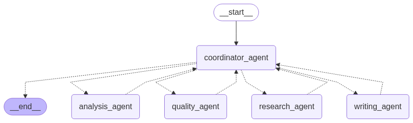
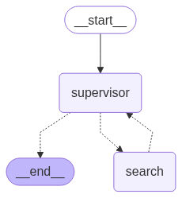
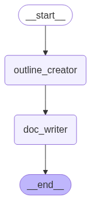
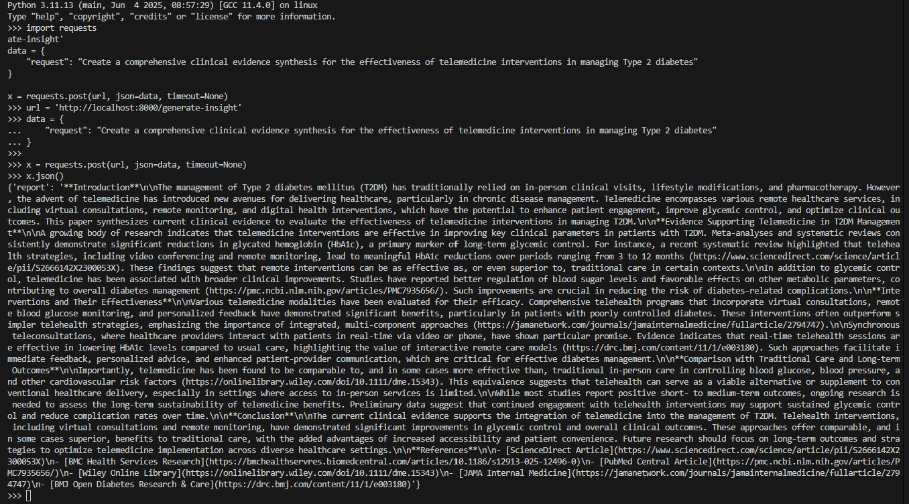

## Ubuntu 22.04.3 | Python 3.11.13

## Architecture Diagram
The overall architecture consists of coordinator agent, research agent, analysis agent, writing agent and quality agent.

1. Super Graph – A single coordinator_agent receives the user prompt and routes it to one of four specialist workers (analysis_agent, research_agent, writing_agent, quality_agent). Each worker reports back, and the coordinator decides the next step until the flow reaches __end__.


2. Research Agent sub-graph – Handles information gathering. A lightweight supervisor node decides whether to invoke a search worker (which uses ReAct + web_search using SerpAPI) or finish immediately. <br>


3. Analysis Agent - It's a ReAct agent created using `langraph.prebuilt.create_react_agent`. It has access to 2 tools to query the statistics through API call and to produce visualization.
Note: the query statistics tool is a dummy function implementation.

4. Writing Agent sub-graph – Produces the draft. It always starts with outline_creator, then hands the outline to doc_writer to generate the write-up, and finally exits. <br>


5. Quality Agent - It's a ReAct agent created using `langraph.prebuilt.create_react_agent`. It scores how completely the draft fulfils the user_request.


## Build docker image <br>
```docker build -t research-assistant .```

## Run docker container to host FastAPI endpoint <br>
```docker run --rm --env-file .env -p 8000:8000 research-assistant:latest```

## API Call
```
import requests

url = 'http://localhost:8000/generate-insight'
data = {
    "request": "Create a comprehensive clinical evidence synthesis for the effectiveness of telemedicine interventions in managing Type 2 diabetes"
}

x = requests.post(url, json=data, timeout=None)
```
## Sample Output


## Enhancement
1. Further prompt engineering: 
Include few-shot examples improve routing accuracy. Tune the prompts of each agent to improve the quality of the output.

2. Tool design & evaluation:
Evaluate the tools and its reliability.

3. Error handling & recovery:
Wrap node call in a `try/except`; on exception, route to dedicated fallback_agent to apologise and escalate